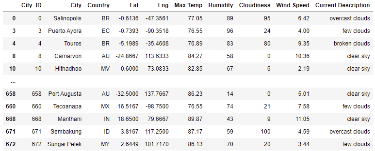
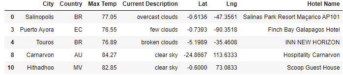
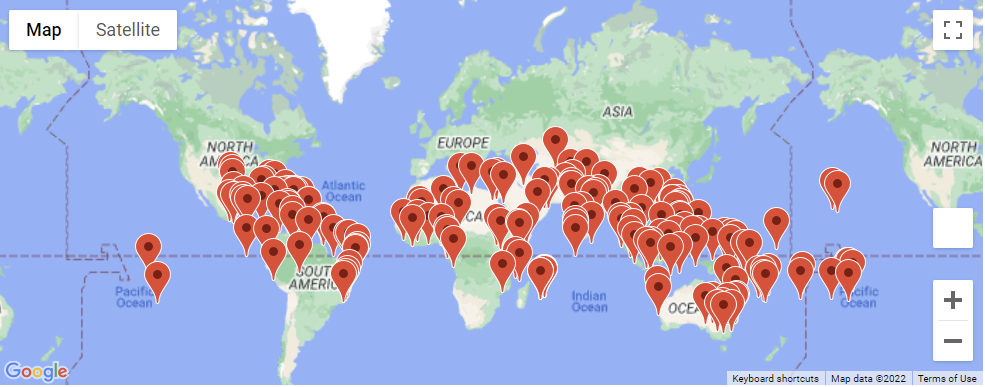
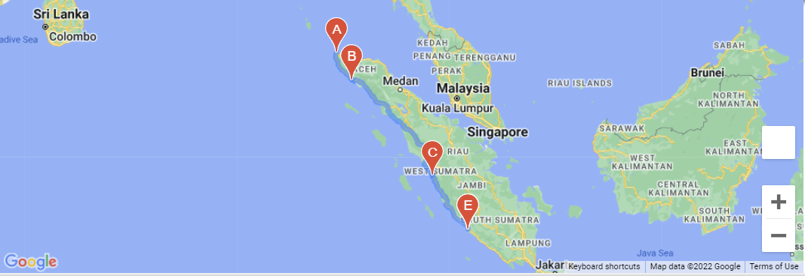
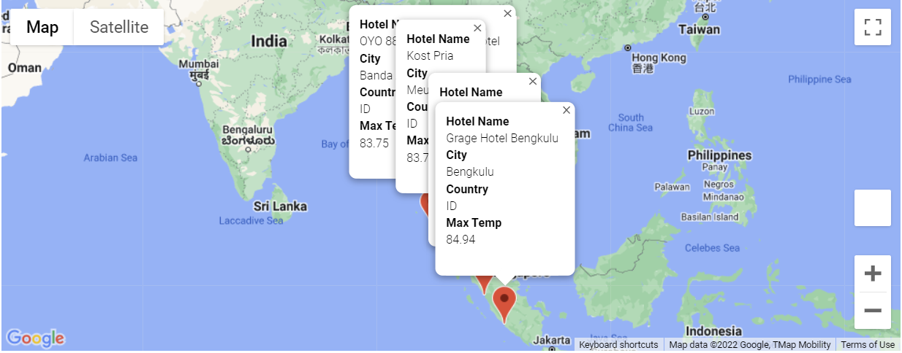

# World_Weather_Analysis
## Overview

Find the best cities to vacation using weather using weather map API and mapbox.

## The way to "Vacation"
### Narrow Travel Searches Based on Temperature and Precipitation

Asked cutomer for information to narrow down the search like: min temp, max temp, raning , snowing etc. From customer input created new data frame.

Then we use Gmaps and google map Api to find the nearby Hotel for each city.

google map view

### Create a Travel Itinerary with a Corresponding Map
* Used information created for hotels in part 2's csv and asked customer to input 4 destination cities.
* Collected information for latitude and longitude for input cities using panadas datatframe.
* Created gmaps directions layer using DRIVING option.

* Added all those four cities information into one dataframe and created marker layer gmap with popups for hotels.

